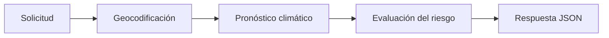

# Weather-Api

[](https://github.com/Justxt/Weather-Api/actions/workflows/devsecops.yml)

Weather-Api es una API REST que estima el riesgo de cancelación de un vuelo a partir del clima previsto para una ciudad y una fecha. El proyecto utiliza Open-Meteo para obtener las coordenadas y recuperar el pronóstico.

El objetivo del repositorio es mantener una entrega reproducible: el mismo cambio que pasa las pruebas y los controles de seguridad es el que se empaqueta, firma y despliega en Kubernetes.

## Integrantes

- Jostin Mora
- Jordan Aguiar
- Sebastian Quishpe

## Tecnologías

- Java 21 y Spring Boot
- Maven Wrapper, JUnit, Checkstyle y JaCoCo
- Docker y GitHub Container Registry
- Kubernetes, Kustomize y Minikube
- GitHub Actions, Semgrep, Checkov, Trivy, OWASP ZAP y Cosign

## Cómo funciona



La API admite fechas desde el día actual hasta 15 días en el futuro. El nivel de riesgo considera velocidad del viento, precipitación y visibilidad.

## Ejecución local

Requisitos:

- JDK 21
- Docker Desktop, únicamente si se utilizará el contenedor o Minikube

En Windows:

```powershell
.\mvnw.cmd spring-boot:run
```

En Linux o macOS:

```bash
./mvnw spring-boot:run
```

Comprobar la aplicación:

```powershell
Invoke-RestMethod http://localhost:8080/api/health
```

Consultar el riesgo de cancelación:

```powershell
$body = @{
    city = "Quito"
    date = (Get-Date).AddDays(3).ToString("yyyy-MM-dd")
} | ConvertTo-Json

Invoke-RestMethod `
    -Method Post `
    -Uri http://localhost:8080/api/flight-cancellation-risk `
    -ContentType "application/json" `
    -Body $body
```

Ejemplo de respuesta:

```json
{
  "riskLevel": "Baja probabilidad de cancelación",
  "message": "El clima parece favorable, tu vuelo probablemente no será afectado.",
  "weatherDetails": {
    "windSpeed": 9.4,
    "precipitation": 0.1,
    "visibility": 80.0,
    "cloudCover": 90
  },
  "latitude": -0.2201641,
  "longitude": -78.5123274
}
```

## Configuración

La aplicación no necesita credenciales externas. Los endpoints de los proveedores pueden reemplazarse mediante variables de entorno:

| Variable | Valor predeterminado |
|---|---|
| `GEOCODING_BASE_URL` | `https://geocoding-api.open-meteo.com/v1` |
| `WEATHER_BASE_URL` | `https://api.open-meteo.com/v1/forecast` |

## Pruebas

```powershell
.\mvnw.cmd -B -ntp clean verify
```

El comando compila el proyecto, aplica Checkstyle, ejecuta las pruebas y genera el reporte JaCoCo en `target/site/jacoco`. El build falla si la cobertura global baja de 85 % en líneas o 75 % en ramas.

## Imagen Docker

```powershell
docker build -t weather-api:local .
docker run --rm -p 8080:8080 weather-api:local
```

La imagen utiliza un build de dos etapas y ejecuta la aplicación con un usuario sin privilegios.

## Despliegue en Minikube

Preparar el clúster:

```powershell
.\scripts\setup-minikube.ps1
```

Construir y desplegar la versión local:

```powershell
.\scripts\deploy-local.ps1
```

Comprobar recursos:

```powershell
kubectl -n weather-api get deployment,pods,service
kubectl -n weather-api port-forward service/weather-api 8080:80
```

## Pipeline DevSecOps

El workflow `.github/workflows/devsecops.yml` contiene los siguientes gates:

1. Build, Checkstyle, pruebas y cobertura.
2. SAST con Semgrep.
3. Validación de políticas con Checkov.
4. SCA de dependencias Java y paquetes del sistema con Trivy.
5. DAST basado en OpenAPI con OWASP ZAP contra un contenedor efímero, incluyendo el endpoint funcional.
6. Publicación en GHCR de la misma imagen analizada y firma keyless con Cosign.
7. Verificación de firma, despliegue por digest en Minikube y smoke test.

Los pull requests ejecutan controles sin publicar ni desplegar. La publicación y el despliegue se realizan únicamente desde `main`.

El despliegue automático necesita un runner Windows autoalojado conectado al Minikube local. La preparación reproducible, las etiquetas, los permisos y el procedimiento de recuperación están en [docs/self-hosted-runner.md](docs/self-hosted-runner.md).

## Seguridad

- No se almacenan tokens ni credenciales en el repositorio.
- Las acciones externas están fijadas por SHA.
- La imagen y el Pod se ejecutan como usuario no root.
- El filesystem raíz es de solo lectura en Kubernetes.
- Se eliminan capabilities Linux y se utiliza seccomp `RuntimeDefault`.
- El despliegue utiliza el digest inmutable firmado, no una etiqueta mutable.

Los reportes de seguridad deben enviarse por medio de [GitHub Security Advisories](SECURITY.md).

## Licencia

Este proyecto se distribuye bajo la [licencia MIT](LICENSE).
